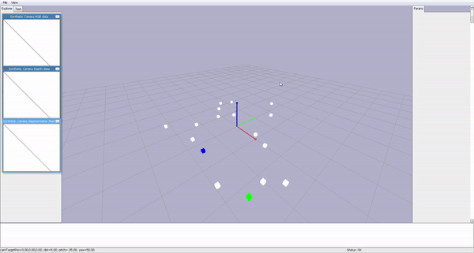

# Multiagent Follow Envirnoment

**Object Oriented MultiAgent Environment** Using [Pybullet](https://github.com/bulletphysics/bullet3)

> There is a lag before it is loaded.


## 🌱 Installation 


`pip install -e .`

## 🌱 User Guide 

### 🐋 1. objects in the environment
Every objects in the enviroment is in the `environment.objects` whose type is dictionary.

```python
# for example
self.objects = {'target':[PhysicalObjects(), PhysicalObjects()],
                'agent':[Agent(), Agent()], 
                'obstacle':[PhysicalObjects(), PhysicalObjects(), PhysicalObjects()]}
```

You can easily calculate an interaction between two objects in the environment 

Every objects in the environment inherits `PhysicalObjects` Class which is the base class for the moving objects. 

|member variables of the object| description| type|
|:-:|:--| :-:|
self.position | current position of the object| `list[3]`| 
self.velocity | current velocity of the object|`list[3]`| 
self.max_speed | maximum speed, the velocity will be bounded | `float`
self.acc | acceleration | `float`
self.speed_decreasing | effect like friction | `float`
self.pid | pybullet id. you can get it by calling `p.loadURDF( )` |  `int`
self.safe_boundary  | to calculate collision between two agents  | `float`
self.move_kind | the movement strategy for the current timestep | `str` |

> Of course you can add more variables if you want!

###  🐋 2. Design strategy of the agent

Agent is also the `PhysicalObject` and there are additional functions for Agent.

With these functions you can implement reinforcement learning code easily

```python
# Example :  FollowAvoid Scenario - Agent Class
# Take action 
def take_action(self, action):
    if action < 5 :
        p.applyExternalForce(self.pid, -1, 
                                forceObj = [Agent.dx[action]*self.acc, Agent.dy[action]*self.acc, 0],
                                posObj=self.position,
                                flags=p.WORLD_FRAME) 
    elif action == 5 :
        p.resetBaseVelocity(self.pid, [0,0,0])
    else:
        raise ValueError("Undefined action %d" %action)

# compute relative position with other PhysicalObject object
def relative_position(self, other):
    reltaive = [other.position[i] - self.position[i] for i in range(3)]
    return reltaive
    
...
```

### 🐋 3. Reinforcement Learning
By giving the position of the obstacles as the observaiton of the agent, you can implement Avoid Obstacles RL task.

* Green : Agent
* White : Obstacle




## 🌱 Questions

If there is some issues or questions please **Submit new Issue**.


